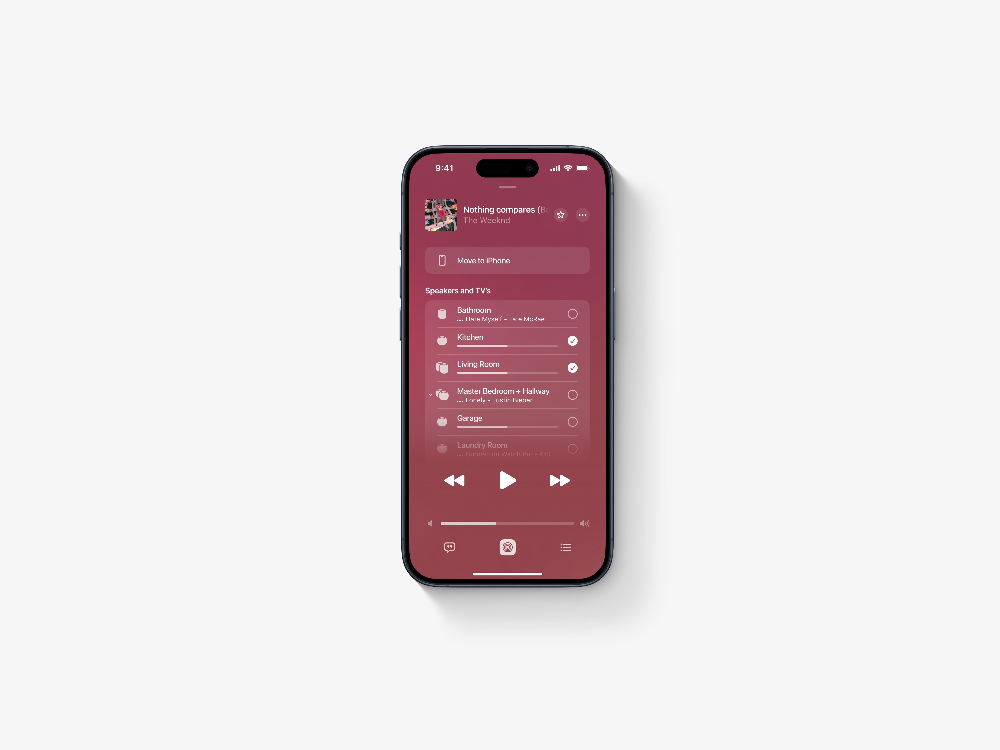
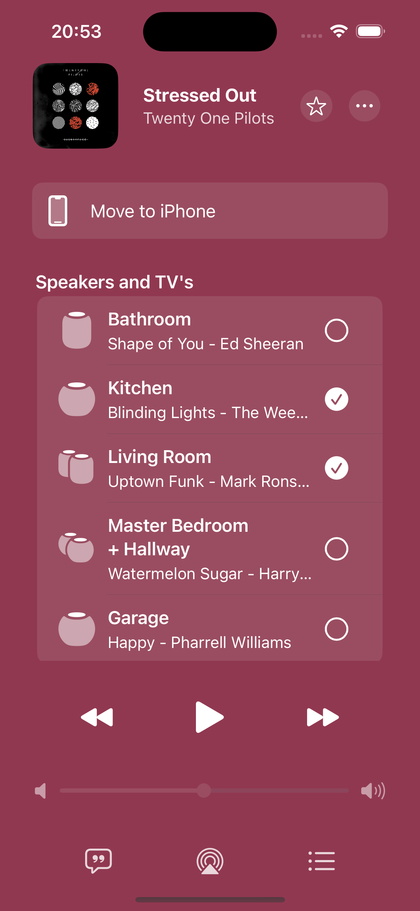

# AirPlay picker

This is an app concept shared and created by the designer [@hiddecollee7](https://x.com/hiddecollee7) on Twitter that I decided to use as an exercise to practice and learn SwiftUI.

You can access the original post [here](https://x.com/hiddecollee7/status/1717272080268267642?s=20).

## Original design

## App Screenshot

My implementations is still not pixel perfect, but this was an great opportunity to learn new tricks.
